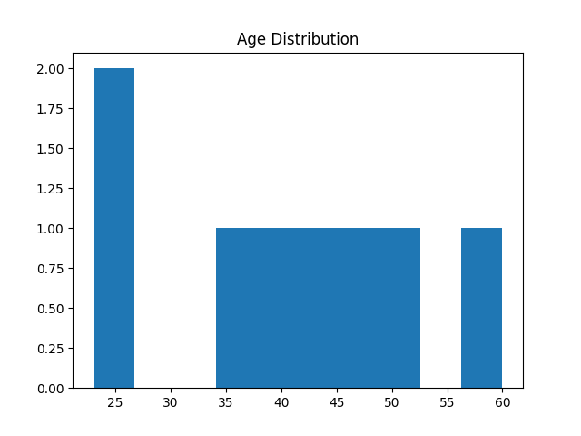
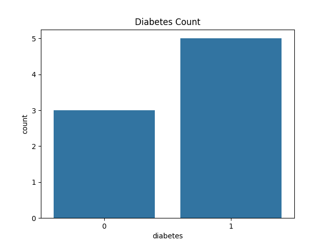

# 🏥 Healthcare Data Analysis Project

This project analyzes healthcare data using data science and machine learning techniques to identify trends, visualize patterns, and predict patient health outcomes.

---
- Analyze patient data
- Identify disease risk factors
- Build predictive models
- Support data-driven healthcare decisions

---

- Python
- Pandas, NumPy
- Matplotlib, Seaborn
- Scikit-learn
- Jupyter Notebook

---
1. Data Collection
2. Data Cleaning
3. Exploratory Data Analysis (EDA)
4. Data Visualization
5. Machine Learning Model

- Visualized health trends
- Built prediction model for diabetes
- Achieved good accuracy

---

```bash
git clone https://github.com/Ammulya2005/healthcare-data-analysis.git
cd healthcare-data-analysis
pip install -r requirements.txt
jupyter notebook
```

healthcare-data-analysis/
│── data/
│── notebooks/
│── src/
│── images/
│── README.md
│── requirements.txt


---


---

### Age Distribution


### Diabetes Count


---

**Ammulya**  
MS Data Science Student
